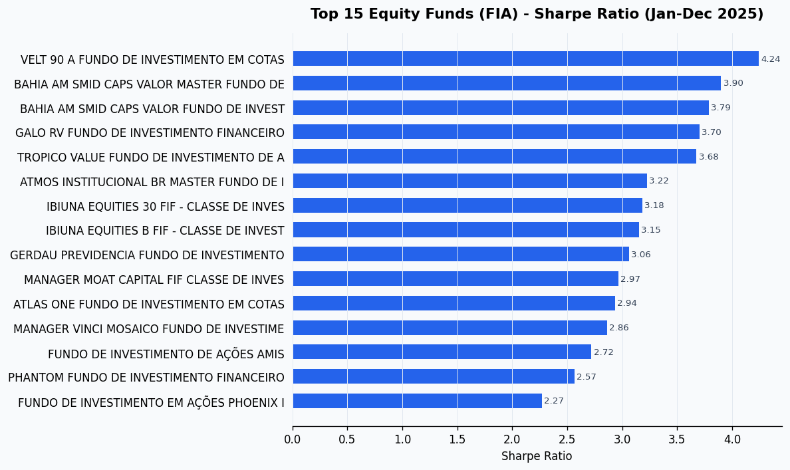
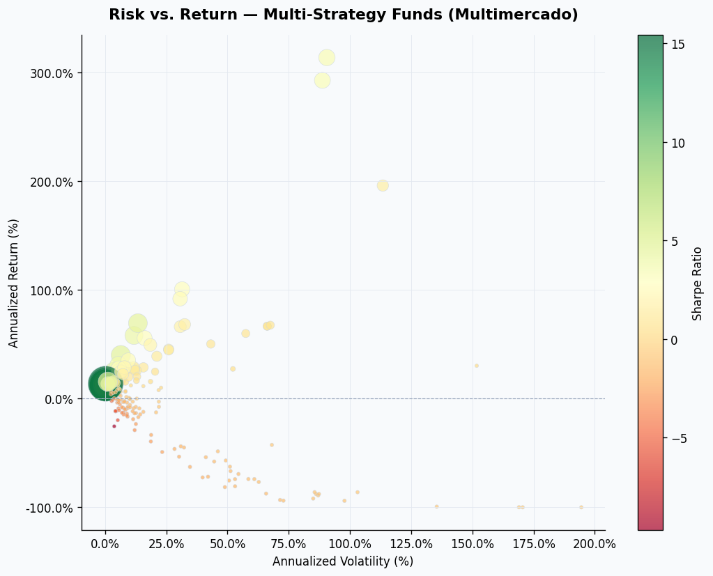
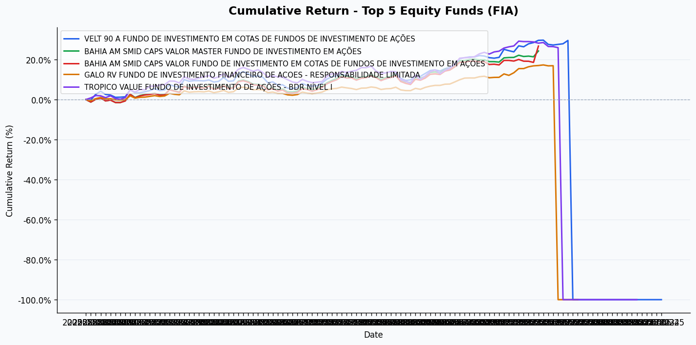
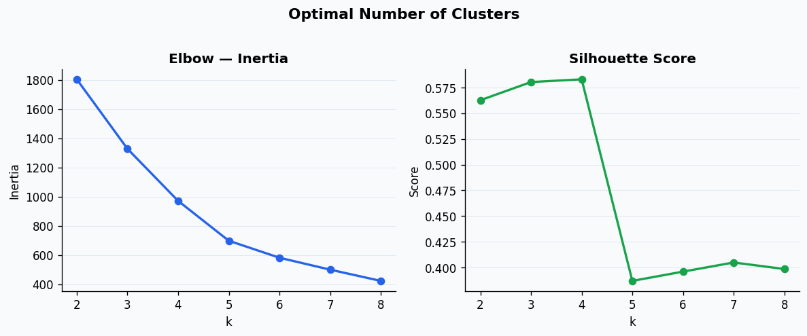
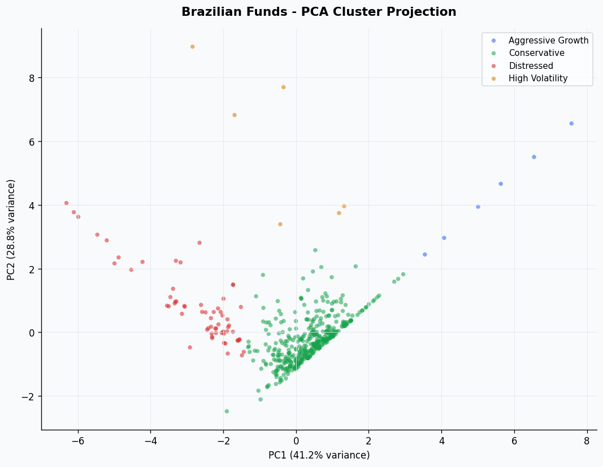
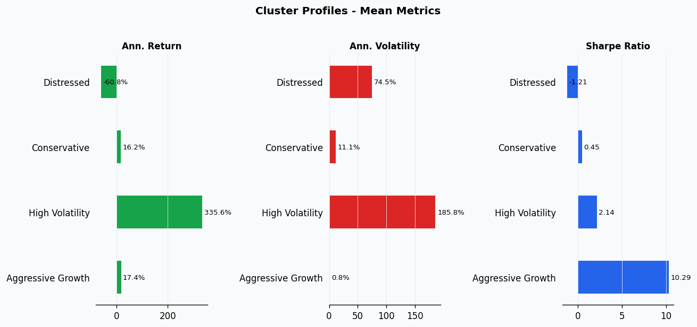

# CVM Fund Analytics

Risk/return analysis and clustering of Brazilian investment funds using public data from the  (Brazilian Securities and Exchange Commission).

---

## Features

**Risk/Return analysis**
- Downloads CVM monthly NAV data as `.zip` files and consolidates into a single DataFrame
- Caches raw CSVs locally — only downloads missing months on subsequent runs
- Computes 6 metrics per fund: cumulative return, annualized return, volatility, Sharpe ratio, max drawdown, Calmar ratio
- Deduplicates the fund register by CNPJ and joins with daily data via `CNPJ_BASE` key
- Screens and ranks funds by class (FIA, FIM, FI-RF, FIC) with chainable filters
- Filters out corrupt NAV series (zero/negative quotes, extreme volatility or return outliers)

**Unsupervised clustering**
- Groups funds by risk/return profile using K-Means
- Elbow method + silhouette score to select optimal k
- PCA projection for 2D cluster visualization
- Cluster profile comparison (mean metrics per group)
- Cluster labels: `Conservative`, `Aggressive Growth`, `High Volatility`, `Distressed`

---

## Metrics

| Metric | Description |
|---|---|
| Cumulative Return | Total NAV appreciation over the period |
| Annualized Return | Geometrically annualized equivalent |
| Annualized Volatility | Std. deviation of daily returns × √252 |
| Sharpe Ratio | Excess return per unit of risk (CDI as risk-free) |
| Maximum Drawdown | Largest peak-to-trough decline |
| Calmar Ratio | Annualized return / \|Max Drawdown\| |

> **Risk-free rate:** CDI approximation (10.5% p.a. — adjust `RISK_FREE_ANNUAL` in `metrics.py`)

---

## Structure

```
cvm-fund-analytics/
├── data/
│   └── raw/               # CVM CSV files (git-ignored)
├── notebooks/
│   └── analysis.py        # End-to-end analysis (jupytext percent format)
├── outputs/               # Saved charts
├── src/
│   ├── __init__.py
│   ├── ingest.py          # CVM data download and register loading
│   ├── metrics.py         # Risk/return metric calculations
│   ├── screener.py        # Fund filtering and ranking
│   ├── clustering.py      # K-Means clustering + PCA visualization
│   └── viz.py             # Matplotlib charts
├── .gitignore
├── LICENSE
├── requirements.txt
└── README.md
```

---

## Quickstart

```bash
# 1. Clone and install
git clone https://github.com/isa-labs/cvm-fund-analytics.git
cd cvm-fund-analytics
pip install -r requirements.txt

# 2. Convert notebook and launch
jupytext --to notebook notebooks/analysis.py
jupyter lab notebooks/analysis.ipynb
```

**Screening example:**

```python
from src.ingest import download_range, load_register
from src.metrics import build_metrics_table
from src.screener import Screener

daily = download_range(start="2025-01", end="2025-12")
register = load_register()
metrics = build_metrics_table(daily, min_days=60)

top = (
    Screener(metrics, register)
    .filter(fund_class="Ações", active_only=True, min_sharpe=0.0)
    .rank_by("sharpe_ratio")
    .top(20)
)
```

**Clustering example:**

```python
from src.clustering import assign_clusters, cluster_summary, find_optimal_k
from src.clustering import plot_elbow, plot_pca_clusters, plot_cluster_profiles

# Find optimal k
elbow_df = find_optimal_k(X_scaled, k_range=range(2, 9))

# Assign clusters with interpretable labels
clustered = assign_clusters(metrics_named, k=4)
print(cluster_summary(clustered))

# Visualize
plot_pca_clusters(metrics_named, clustered)
plot_cluster_profiles(clustered)
```

---

## Outputs

Charts are saved to the `outputs/` folder after running the notebook.

**Top 15 Equity Funds — Sharpe Ratio**


**Risk vs. Return — Multi-Strategy Funds**


**Cumulative Return — Top 5 Equity Funds**


**Optimal Number of Clusters (Elbow + Silhouette)**


**PCA Cluster Projection**


**Cluster Profiles — Mean Metrics**


---

## Data source

All data is fetched directly from **CVM's open data portal**. Files are published monthly in `.zip` format, semicolon-separated, Latin-1 encoded. No authentication required.

| Dataset | URL |
|---|---|
| Daily fund NAV (inf_diario) | `dados.cvm.gov.br/dados/FI/DOC/INF_DIARIO/DADOS/` |
| Fund register (cadastro) | `dados.cvm.gov.br/dados/FI/CAD/DADOS/` |

CVM files are published monthly, semicolon-separated, Latin-1 encoded. No authentication required.

---

## Fund classes

| Class | Description |
|---|---|
| `Ações` | Equity funds (FIA) |
| `Multimercado` | Multi-strategy funds (FIM) |
| `Renda Fixa` | Fixed income funds |
| `FIDC` | Credit rights funds |
| `FIP` | Private equity funds |
| `Referenciado` | Index-tracking funds |
| `FIP Multi` | Multi-strategy private equity funds |
| `FIDC-NP` | Non-performing credit rights funds |
| `FII` | Real estate investment funds |
| `Curto Prazo` | Short-term funds |
| `FIC FIDC` | Fund of credit rights funds |
| `Cambial` | FX funds |
| `Dívida Externa` | External debt funds |
| `FIC FIP` | Fund of private equity funds |
| `FICFIDC-NP` | Fund of non-performing credit rights funds |
| `FMIEE` | Innovative companies investment funds |
| `FIP IE` | Infrastructure private equity funds |
| `FIP EE` | Energy efficiency private equity funds |
| `FIP CS` | Strategic sector private equity funds |
| `FUNCINE` | Film industry investment funds |
| `FMP-FGTS` | FGTS investment funds |
| `FII-FIAGRO` | Agribusiness real estate funds |
| `FIDCFIAGRO` | Agribusiness credit rights funds |
| `FIP PD&I` | R&D private equity funds |
| `FIP-FIAGRO` | Agribusiness private equity funds |
| `FIDC-PIPS` | Social inclusion credit rights funds |

---

## License

MIT — data sourced from CVM under Brazil's [Lei de Acesso à Informação (LAI)](http://www.planalto.gov.br/ccivil_03/_ato2011-2014/2012/lei/l12527.htm).